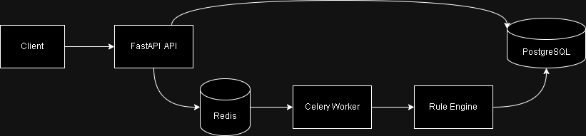
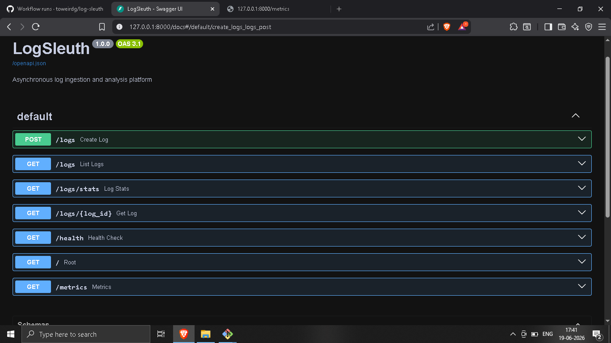
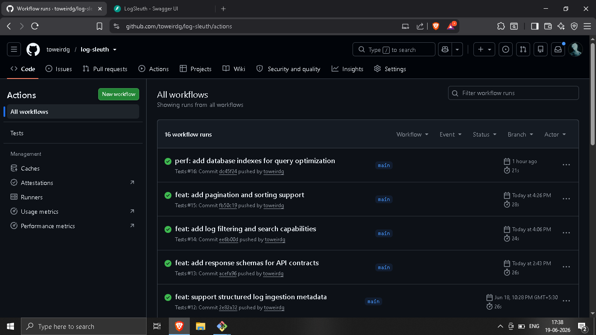
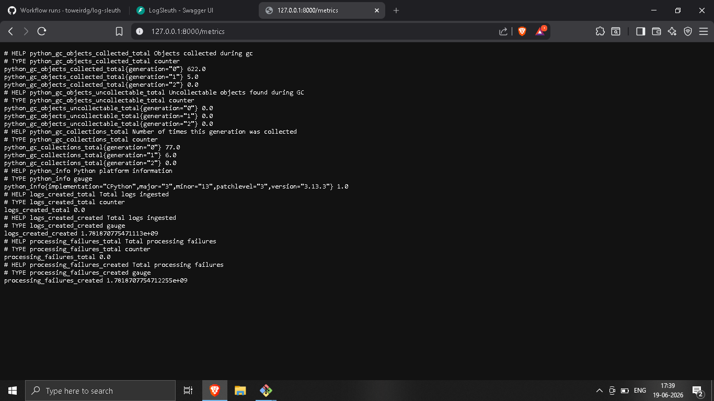

# LogSleuth

Backend observability platform for ingesting, processing, classifying, and analyzing application logs using FastAPI, PostgreSQL, Redis, and Celery.

Asynchronous log ingestion and analysis platform designed to demonstrate backend engineering concepts including task queues, observability, API design, and database optimization.

[](https://github.com/toweirdg/log-sleuth/actions/workflows/tests.yml)

31 Tests Passing • Dockerized • CI/CD Enabled • Async Processing

---

## Highlights

- Async log processing using Celery + Redis
- Dockerized multi-service architecture
- CI pipeline with GitHub Actions
- Prometheus metrics and health monitoring
- Filtering, pagination, and sorting support
- 31 automated tests

---
## 🧠 Problem

* Modern systems generate large volumes of operational logs. 
* Manual inspection becomes slow and inefficient when identifying failures, repeated issues, and service disruptions.

---

## 💡 Solution

LogSleuth provides:

* Centralized log ingestion
* Asynchronous background processing
* Rule-based pattern detection
* Severity classification
* Operational recommendations
* Metrics and health monitoring

---

## Log Processing Workflow

1. Client submits log via POST /logs
2. FastAPI stores log in PostgreSQL
3. Celery task is queued through Redis
4. Worker processes log
5. Rule engine detects patterns
6. Severity and actions are generated
7. Processed result is stored
8. User retrieves result via API

---
## Features

- FastAPI REST API
- PostgreSQL persistence layer
- SQLAlchemy ORM
- Redis message broker
- Celery background workers
- Rule-based pattern detection
- Severity classification engine
- Action recommendation engine
- Filtering, pagination, and sorting APIs
- Prometheus-compatible monitoring metrics
- Health check endpoint
- Structured logging via structlog
- Indexed database queries for efficient log retrieval
- Docker Compose deployment
- GitHub Actions CI pipeline
- 31 automated tests

---
## Architecture 


[!Architecture](docs/images/architecture.png)
=======



### Design Decisions

- API requests return immediately after queuing tasks
- Redis acts as broker between API and workers
- Celery handles asynchronous processing
- PostgreSQL stores raw and processed logs
- Indexed columns optimize query performance

---
## API Endpoints Table

| Method | Endpoint    | Description        |
| ------ | ----------- | ------------------ |
| POST   | /logs       | Create log         |
| GET    | /logs       | List logs          |
| GET    | /logs/{id}  | Retrieve log       |
| GET    | /logs/stats | Statistics         |
| GET    | /health     | Health check       |
| GET    | /metrics    | Prometheus metrics |


## Example Request 
```json
{
  "message": "database connection refused",
  "level": "ERROR",
  "service": "auth-service",
  "host": "server-01"
}
```
## Example Response
```json
{
  "id": 7,
  "status": "processed",
  "severity": "CRITICAL",
  "pattern": "connection refused",
  "action": "Investigate service availability"
}
```
---

### 🛠️ Tech Stack

### Core Backend
* Python
* FastAPI
* SQLAlchemy
* Pydantic

### Database
* PostgreSQL

### Async Processing
* Redis 
* Celery 

### Observability
* Prometheus
* structlog

### DevOps
* Docker
* Docker Compose
* Git & GitHub

### Testing
* Pytest

---

## Screenshots

### API Documentaion



### CI Pipeline



### Metrics Endpoint



---

## Project Structure
```text
app/
├── api/
│   └── routes/
├── core/
├── db/
├── models/
├── schema/
├── services/
├── workers/
└── main.py

tests/

docker-compose.yml
requirements.txt
README.md

```
---
### Running Locally
```bash
git clone https://github.com/toweirdg/log-sleuth.git

cd log-sleuth

python -m venv venv

# Linux / macOS
source venv/bin/activate

# Windows
venv\Scripts\activate

pip install -r requirements.txt

uvicorn app.main:app --reload
```
---
### Run with Docker
```bash
docker compose up --build
```

---

## Testing

Run: 
```bash
pytest -v
```
31 automated tests covering:

- API endpoints
- Rule engine
- Severity classification
- Decision engine
- Health checks
- Metrics endpoint
- Filtering
- Pagination
- Sorting

---
## 👨‍💻 Author

Gulshan Kumar

- GitHub: https://github.com/toweirdg
- LinkedIn: https://linkedin.com/in/glshankrtoowd
